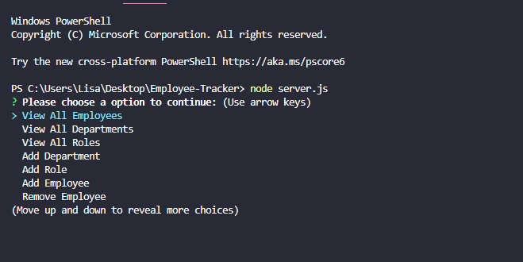

# Employee-Tracker

by Lisa Le

## Description

As a business owner, this application will allow them to view and manage the department, roles, and employees that are in the company. This will help with organization and planning of the business.

## Acceptance Criteria

User will be able to start application on a cammand line that will accept input. Options will be presented for the user and they will be able to view departments, employees, and roles. They will be able to add new roles, employees, and departments. The user will also be able to edit those values by removing or deleting. All data will be presented in a table form and will also be added into the database.

## Techinques and Technology

    -Node.js
    -Express.js
    -MYSQL/MYSQL2
    -Inquirer
    -Dotenv

## Demo

[Demo Video Link](https://drive.google.com/file/d/1Mb9Xdqlur5bn4jciQ9UfljbmYdqHLxqS/view)

## Screenshot

